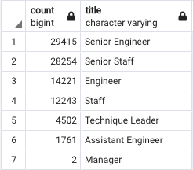
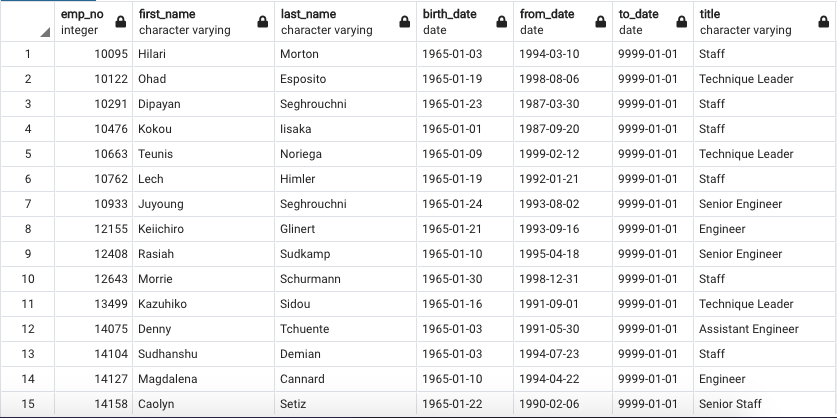

# Pewlett-Hackard-Analysis

## Purpose
The purpose of our challenge was to help Pewlett Hackard determine the upcoming number of retiring employees per department, so that they can plan how to best prepare for filling the retirees' roles. Their plan is to use this information to create a mentoring program to help ease the pain of so many employees retiring in a short timeframe. The soon-to-be retired employees will step back into part-time roles while helping to train and mentor newly hired employees.

## Results
- Our first task was to create a set of tables containing the unique titles of employees who are set to retire. We then used this table to break down how many retirees there are per title. This will inform Pewlett Hackard as to how many upcoming role openings there will be per title:

- On the high end, there are 29,415 upcoming openings for Senior Engineers, and on the low end, only 2 upcoming openings for Managers. This table will be extremely useful for future planning for the company.

- Our second task was to create a Mentorship Eligibility table for current employees who were born between January 1, 1965 and December 31, 1965. This will provide Pewlett Hackard with the information for all employees who are set to retire that they can utilize for their upcoming mentoring program, and will hopefully help to lighten the load for the company with so many upcoming role openings:

- After analysis, we discovered that the company has 1,549 employees that they can turn to as possible mentors for their future new hires.

## Summary
In order to best prepare for Pewlett Hackard's upcoming "silver tsunami," they will need to prepare to hire 90,398 new employees. That's a very big void to fill! As we discovered when creating our Mentorship Eligibility table, there are only 1,549 employees for the company to utilize as mentors for their upcoming mentorship program. That means that for every mentor, there are approximately 58 new hires that will need mentoring. They might need to expand their window of mentorship eligibility to include employees who have more time before they retire, in order to obtain sufficient support for their new hires.

Another query that I believe would be helpful to run in order to assist the company would be how many retirees there will be per department. This could assist the company in divvying up the eligible mentors with their respective new hires per department. I also think it would be important to run a query regarding the sum of salaries of retirees per department. This will help assist the company with budgeting for new hire salaries, as they might be able to save money when hiring less experienced or entry-level employees.
